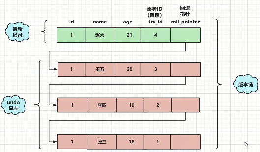

# 1. 什么是MVCC
全称Multi-Version Concurrency Control，即**多版本并发控制**，主要是为了提高数据库的并发性能。以下文章都是围绕InnoDB引擎来讲，因为myIsam不支持事务。

同一行数据平时发生读写请求时，会上锁阻塞住。但mvcc用更好的方式去处理读—写请求，做到在发生读—写请求冲突时不用加锁。

这个读是指的快照读，而不是当前读，当前读是一种加锁操作，是悲观锁。

# 2. 当前读和快照读
什么是MySQL InnoDB下的当前读和快照读？
## 2.1. 当前读
它读取的数据库记录，都是当前最新的版本，**会对当前读取的数据进行加锁，防止其他事务修改数据**。是悲观锁的一种操作。
  
如下操作都是当前读：
- select lock in share mode (共享锁)
- select for update (排他锁)
- update (排他锁)
- insert (排他锁)
- delete (排他锁)
- 串行化事务隔离级别

## 2.2. 快照读
快照读的实现是基于多版本并发控制，即MVCC，既然是多版本，那么快照读读到的数据不一定是当前最新的数据，有可能是之前历史版本的数据。

如下操作是快照读：
- 不加锁的select操作（注：事务级别不是串行化）

## 2.3. 快照读与mvcc的关系
MVCCC是“维持一个数据的多个版本，使读写操作没有冲突”的一个抽象概念。这个概念需要具体功能去实现，这个具体实现就是快照读。（具体实现下面讲）

# 3. 数据库并发场景

- 读-读：不存在任何问题，也不需要并发控制
- 读-写：有线程安全问题，可能会造成事务隔离性问题，可能遇到脏读，幻读，不可重复读
- 写-写：有线程安全问题，可能会存在更新丢失问题，比如第一类更新丢失，第二类更新丢失

## 3.1. MVCC解决并发哪些问题？

**mvcc用来解决读—写冲突的无锁并发控制**，就是为事务分配单向增长的时间戳。为每个数据修改保存一个版本，版本与事务时间戳相关联。

读操作只读取该事务开始前的数据库快照。

**解决问题如下：**

- 并发读-写时：可以做到读操作不阻塞写操作，同时写操作也不会阻塞读操作。
- 解决脏读、幻读、不可重复读等事务隔离问题，但不能解决上面的写-写 更新丢失问题。
# 4. MVCC的实现原理
MVCC的实现原理主要是**版本链**，**undo log**，**ReadView**
## 4.1. 版本链
我们数据库中的每行数据，除了我们定义的一条记录的各个字段数据，还有几个隐藏字段，分别是db_trx_id、db_roll_pointer、db_row_id。
- db_trx_id：6byte，最近修改(修改/插入)**事务ID**，记录创建这条记录/最后一次修改该记录的事务ID。
- db_roll_pointer（版本链关键）：7byte，**回滚指针**，指向这条记录的上一个版本（存储于rollback segment里）
- db_row_id：6byte，隐含的自增ID（隐藏主键），如果数据表没有主键，InnoDB会自动以db_row_id产生一个聚簇索引。

db_row_id是数据库默认为该行记录生成的唯一隐式主键，db_trx_id是当前操作该记录的事务ID，而db_roll_pointer是一个回滚指针，用于配合undo log，**指向上一个旧版本**。

每次对数据库记录进行改动，都会记录一条undo日志，每条undo日志也都有一个roll_pointer属性（INSERT操作对应的undo日志没有该属性，因为该记录并没有更早的版本），可以将这些undo日志都连起来，串成一个链表，所以现在的情况就像下图一样：

对该记录每次更新后，都会将旧值放到一条undo日志中，就算是该记录的一个旧版本，随着更新次数的增多，所有的版本都会被roll_pointer属性连接成一个链表，我们把这个链表称之为**版本链**，版本链的头节点就是当前记录最新的值。另外，每个版本中还包含生成该版本时对应的**事务id**，这个信息很重要，在根据ReadView判断版本**可见性**的时候会用到。

## 4.2. undo log
Undo log 主要用于**记录数据被修改之前的日志**，在表信息修改之前先会把数据拷贝到undo log里。当事务进行**回滚**时可以通过undo log 里的日志进行数据还原。

### Undo log的用途

- 保证事务进行rollback时的**原子性**和**一致性**，当事务进行回滚的时候可以用undo log的数据进行恢复。
- 用于MVCC快照读的数据，在MVCC多版本控制中，通过读取undo log的历史版本数据可以实现不同事务版本号都拥有自己独立的快照数据版本。

### undo log主要分为两种

- insert undo log：代表事务在insert新记录时产生的undo log, 只在事务回滚时需要，并且在事务提交后可以被立即丢弃
- update undo log（主要）：事务在进行update或delete时产生的undo log;不仅在事务回滚时需要，在快照读时也需要；

所以不能随便删除，只有在快速读或事务回滚不涉及该日志时，对应的日志才会被purge线程统一清除

## 4.3. Read View(读视图)
事务进行快照读操作的时候生产的**读视图(Read View)**，在该事务执行的快照读的那一刻，会生成数据库系统当前的一个快照。记录并维护系统当前**活跃事务**的ID(没有commit的事务，当每个事务开启时，都会被分配一个ID, 这个ID是递增的，所以越新的事务，ID值越大)，是系统中当前不应该被本事务看到的其他事务id列表。

**Read View主要是用来做可见性判断的**, 即当我们某个事务执行select快照读的时候，对该记录创建一个Read View读视图，把它比作条件用来判断当前事务能够看到哪个版本的数据（select出哪个版本的数据），既可能是当前最新的数据，也有可能是该行记录的undo log里面的某个版本的数据。

**Read View几个属性**

- trx_ids: 当前系统活跃(未提交)事务版本号集合。
- max_trx_id: 创建当前read view 时系统应该分配给下一个事务的版本号”，等于当前最大的活跃的事务id+1。
- min_trx_id: 创建当前read view 时“系统正处于活跃事务最小版本号”
- creator_trx_id: 创建当前read view的事务id；

### ReadView如何判断版本链中哪个版本可用？
- trx_id == creator_trx_id：可以访问这个版本
- trx_id < min_trx_id：可以访问这个版本
- trx_id > max_trx_id：不可以访问这个版本
- min_trx_id <= trx_id <= max_trx_id：如果trx_id在trx_ids中，则不可以访问这个版本；否则可以访问该版本

# 5. MVCC和事务隔离级别

上面所讲的Read View用于支持**RC（Read Committed，读提交）**和**RR（Repeatable Read，可重复读）**隔离级别的实现。

## 5.1. RR、RC生成时机
- RC隔离级别下，是每个快照读都会生成并获取最新的Read View（**每次执行select查询时会生成一个ReadView，单位是select**）；
- 而在RR隔离级别下，则是同一个事务中的第一个快照读才会创建Read View, 之后的快照读获取的都是同一个Read View，之后的查询就不会重复生成了，所以一个事务的查询结果每次都是一样的。（单位是事务）

## 5.2. 解决幻读问题
- 快照读：通过MVCC来进行控制的，不用加锁。事务开始的时候，只会生成一份ReadView，之后对数据库再怎么修改、更新，都只会读到刚才那份ReadView，所以就解决了幻读的问题。
- 当前读：通过next-key锁（行锁+gap锁）来解决问题的。

## 5.3. RC、RR级别下的InnoDB快照读区别
- 在RR级别下的某个事务的对某条记录的第一次快照读会创建一个快照及Read View， 将当前系统活跃的其他事务记录起来，**此后在调用快照读的时候，还是使用的是同一个Read View**，所以只要当前事务在其他事务提交更新之前使用过快照读，那么之后的快照读使用的都是同一个Read View，所以对之后的修改不可见；

**即RR级别下，快照读生成Read View时，Read View会记录此时所有其他活动事务的快照，这些事务的修改对于当前事务都是不可见的。而早于Read View创建的事务所做的修改均是可见**  
- 而在RC级别下的，事务中，每次快照读都会新生成一个快照和Read View, 这就是我们在RC级别下的事务中可以看到别的事务提交的更新的原因