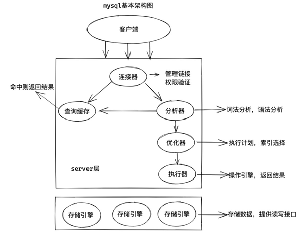

总的来说，mysql分为两个大的模块，一块是服务层，一块是存储引擎层。

- server层包括了连接器，查询缓存，分析器，优化器，执行器等，覆盖了sql绝大多数核心的功能，比如内置函数，存储过程，示图，触发器等等
- 不同的存储引擎是共用一个server层的

# 1. 连接器
第一步，你会先连接到这个数据库上，这时候接待你的就是连接器。连接器负责跟客户端建立连接、获取权限、维持和管理连接。
```
mysql -h$ip -P$port -u$user -p
```
连接命令中的mysql是客户端工具，用来跟服务端建立连接。在完成经典的TCP握手后，连接器就要开始认证你的身份，这个时候用的就是你输入的用户名和密码。

- 如果用户名或密码不对：你就会收到一个"Access denied for user"的错误，然后客户端程序结束执行。
- 如果用户名密码认证通过：连接器会到权限表里面查出你拥有的权限。之后，这个连接里面的权限判断逻辑，都将依赖于此时读到的权限。

连接完成后，如果你没有后续的动作，这个连接就处于空闲状态，客户端如果太长时间没动静，连接器就会自动将它断开。这个时间是由参数wait_timeout控制的，默认值是8小时。

如果之后客户端再次请求mysql，此时就会报错，那么我们只能重新再连接一次mysql了。

**数据库里面**：
- 长连接是指连接成功后，如果客户端持续有请求，则一直使用同一个连接。
- 短连接则是指每次执行完很少的几次查询就断开连接，下次查询再重新建立一个。
  
但是由于连接的建立是比较消耗资源的，所以在我们的使用过程中要尽可能的减少连接的次数。

# 2. 查询缓存
在连接建立完成之后，就开始执行我们的select语句了。这个时候mysql就会去查询缓存中查询，看看我们刚才有没有执行过这条语句：
- 如果有的话，就直接将缓存的结果返回给客户端。
- 如果没有，就会进入下一步。
  
当进入后续步骤查询出来结果后，会再次将查询出来的结果放入查询缓存当中。所以，使用查询缓存的效率是非常高的，但是使用查询缓存却有很大的弊端。**查询缓存的失效非常频繁，只要有对一个表的更新，这个表上所有的查询缓存都会被清空**。因此很可能你费劲地把结果存起来，还没使用呢，就被一个更新全清空了。对于更新压力大的数据库来说，查询缓存的命中率会非常低。除非你的业务就是有一张静态表，很长时间才会更新一次。

# 3. 分析器
如果没有命中缓存，接下来就会走到分析器这一步了。mysql会根据自己定好的规则针对你的这条语法进行分析，比如select代表查询，where代表条件等等。

到了这一步：

- 如果你的sql出现了问题，那么mysql就会抛出一个错误：
```
You have an error in your SQL syntax; check the 。。。。。。。
```
- 如果没有问题，那么就会进入下一步

# 4. 优化器
到了这一步的时候，mysql已经知道你要做什么了，但是在最终执行你的命令之前，mysql还要进行一遍优化，比如**索引的选择**。
```
select name from girlfriends g left join boyfirends b on g.id = b.idwhere a.age = '18' and b.age = '19';
```
在上述语句中mysql就会去判断，是先从a.age这个索引进入还是b.age这个索引进入，哪种效率高呢？这就是优化器的工作。

在优化完成之后，mysql已经确定好了最终的执行方式。

# 5. 执行器
于是就到了我们的执行器阶段，到底应该怎么执行。

* 首先，会调取用户的权限：
    * 如果没有权限，则会反回错误
    * 如果用户拥有权限，则会打开表继续执行
```
select name from girlfriends where age = '18';
```

比如我们文章开头这条语句，假如age没有索引，执行流程如下：
- 调用InnoDB引擎接口取这个表的第一行，判断age值是不是18，如果不是则跳过，如果是则将这行存在结果集中
- 调用引擎接口取“下一行”，重复相同的判断逻辑，直到取到这个表的最后一行
- 执行器将上述遍历过程中所有满足条件的行组成的记录集作为结果集返回给客户端