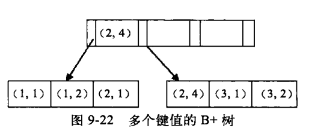
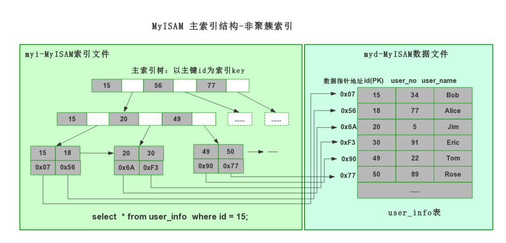
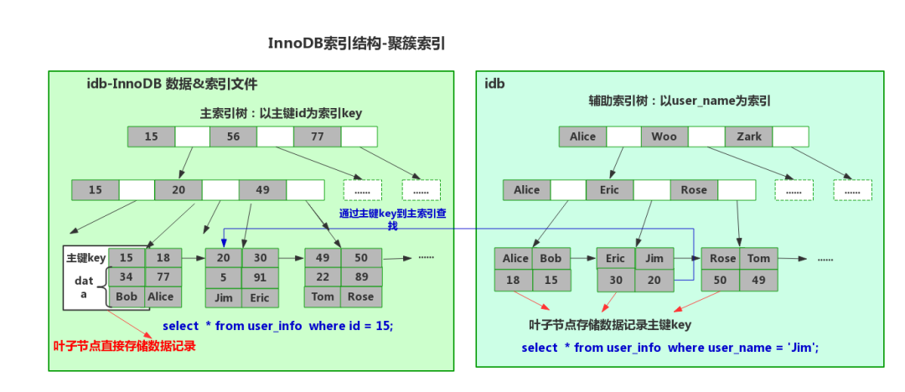

# MySql索引
## 1. 什么是索引
索引相当于一本书的目录，通过目录可以快速找到对应的资源。在数据库方面，查询一张表有两种检索方式：  
- 1. 全表扫描
- 2. 根据索引检索（效率很高）

索引为什么可以提高检索效率：最根本的原理是缩小了检索的范围。
* **注意**：索引虽然可以提高检索效率，但不能随意添加索引，因为索引也是数据库中的对象，需要数据库不断的维护，是有维护成本的。比如表中的数据经常被修改，就不适合添加索引，因为数据一旦被修改，索引就需要重新排序，进行维护。

添加索引是给某一字段，或者某些字段添加索引。
```
select ename, sal from emp where ename = 'SMITH';
```
当ename字段上没有添加索引的时候，以上sql语句会进行全表扫描，扫描ename字段中所有的值  
当ename字段上添加索引的时候，以上sql语句会根据索引扫描，快速定位  

## 2. 创建索引和删除索引
### 2.1. 创建索引
* 语法：
```
create index
    索引名
on
    表名(要创建索引的字段名);
```
* Example：给emp表的sal字段添加索引：
```
create index emp_sal_index on emp(sal);
```
### 2.2. 删除索引
```
drop index 索引名 on 表名;
```
## 3. 什么时候考虑添加索引
* 数据量庞大（根据客户需求和线上的环境）
* 该字段很少DML操作，因为字段进行修改操作，索引也需要维护
* 该字段经常出现在**where**子句中（经常根据哪个字段查询）

## 4. 注意
主键和具有unique约束的字段会自动添加索引，所以根据主键查询效率较高。尽量根据主键检索。

## 5. 查看sql语句的执行计划
* 首先，不添加索引，查询工资等于5000的员工名字：
```
explain select ename, sal from emp where sal = 5000;

mysql> explain select ename, sal from emp where sal = 5000;
+----+-------------+-------+------+---------------+------+---------+------+------+-------------+
| id | select_type | table | type | possible_keys | key  | key_len | ref  | rows | Extra       |
+----+-------------+-------+------+---------------+------+---------+------+------+-------------+
|  1 | SIMPLE      | emp   | ALL  | NULL          | NULL | NULL    | NULL |   14 | Using where |
+----+-------------+-------+------+---------------+------+---------+------+------+-------------+
1 row in set (0.02 sec)
// 注意：type-all，rows = 14，即扫描了全表
```
* 然后，给sal添加索引，再次查询：
```
mysql> create index emp_sal_index on emp(sal);
Query OK, 0 rows affected (0.24 sec)
Records: 0  Duplicates: 0  Warnings: 0

mysql> explain select ename, sal from emp where sal = 5000;
+----+-------------+-------+------+---------------+---------------+---------+-------+------+-------------+
| id | select_type | table | type | possible_keys | key           | key_len | ref   | rows | Extra       |
+----+-------------+-------+------+---------------+---------------+---------+-------+------+-------------+
|  1 | SIMPLE      | emp   | ref  | emp_sal_index | emp_sal_index | 9       | const |    1 | Using where |
+----+-------------+-------+------+---------------+---------------+---------+-------+------+-------------+
1 row in set (0.00 sec)

// 注意：row = 1
```

## 6. 索引的底层原理：B+Tree
B+Tree介绍：https://blog.csdn.net/hao65103940/article/details/89032538

### 为什么使用B+树？
##### 为什么不用哈希索引？
哈希查找效率高（O(1)），但hash是一些无序的值，不能进行范围的查找，不支持数据库里面很多的大于、小于的查询。  
其次，使用hash索引不能够进行排序，因为hash是一些无序的值。  
第三，不同的值可能hash到同一个哈希索引，这时候就需要一个一个比对，相当于全表扫描，效率很低。

##### 为什么不用平衡二叉树索引？
首先，平衡二叉树是一颗二叉树，查找效率是log(n)。随着树高度的增加，其查找速度也会越来越慢；  
其次，某些查找可能需要回旋查询。比如在下面一颗平衡二叉树中查找>5的值，需要从5的节点一直往上查找，找到6、7、8、9、10. 如果大于5的数据非常多，那么回旋查询会比较多，导致查找效率很低；  
最后，增加，删除，平衡二叉树索会进行频繁的调整，来保证平衡二叉树索的性质，浪费时间。  
```
      4
    /   \
   2     8
  / \   / \
 1   3 6   9
       /\   \
      5  7   10
```
##### 为什么不使用B树？
B树一个节点可以存储多个值，会大大减小树的高度，查找速度会更快。  
但B树仍旧存在回旋查找的问题。
##### 为什么使用B+树？
B+树一个节点可以存储多个值，会大大减小树的高度，查找速度会更快。  
同时，B+树解决了回旋查找的问题：其叶子节点通过链表串联在一起，并且是有序的。当进行返回查找的时候，通过链表可以一下把>5的数据都取出来。所以排序也最好使用索引排序。
非叶子节点只存储Key，叶子节点同时存在Key和Value。

## 7. 索引的底层实现原理
- 1. 当创建索引的sql语句执行后，在内存或硬盘中（取决于存储引擎）会生成一个索引对象。原表中每个数据都存储在一个唯一的物理地址。
```
create index index_ename on emp(ename);
```
- 2. 索引会自动排序。排序时数据和其物理地址在一块。  
- 3. 索引会分区，将数据按区拆分开，存储在B+Tree上
- 4. 当查询时，会首先检查所要查询的字段是否有索引，如果有，则找到该字段对应的索引对象，然后通过索引检索
```
select ename from emp where ename = 'SMITH';
```
- 5. 检索时，先根定位到某个区，继续定位第二个区...**缩短了扫描范围和数量**，很快定位到SMITH，并且取到SMITH存储的物理地址。
- 6. 此时上面的查询语句变化为如下：
```
select ename from emp where 物理地址 = SMITH的物理地址;
```
此时，MySql不会再去表中取数据，而是**直接定位到SMITH的物理地址**，效率是最高的。

## 8. 索引的分类
* 单一索引：给单个字段添加索引
* 复合索引：给多个字段联合起来添加索引
* 主键索引：主键上会自动添加索引
* 唯一索引：有unique约束的字段会自动添加索引
* ...

## 9. 索引什么时候会失效
### 9.1. 索引失效的场景
* 模糊查询时第一个字符使用的是%，索引会失效。

### 9.2. 索引失效的原因
* 最左前缀匹配原则：在MySQL建立联合索引时会遵守最左前缀匹配原则，即最左优先，在检索数据时从联合索引的最左边开始匹配。


索引失效主要针对联合索引，联合索引的一个节点上有多个键值对。以两个为例，假设索引由a和b两个字段组成联合索引。联合索引由两个特点：
- 1. 在B+树中，**索引是按照a字段有序排列，而b字段则无序**。
- 2. 只有在a字段相等时，b字段才是有序的。即，**联合索引的排序，是首先按照第一个字段排序；当第一个字段相等时，再按照第二个字段排序**。

##### Example 1：
我们以user_name和lan_id作联合索引，执行下面的SQL语句：
```
// 1. 
select * from t_user where user_name = 'jungle' and lan_id = 1;

// 2. 
select * from t_user where lan_id = 1;

```
- 1. 第一行SQL命令遵循了**最佳左前缀法则**，因此索引生效；由于第一个字段user_name是有序的，因此会首先按照user_name进行**二分查找**；找到user_name='junle'以后，第一个字段已确定，第二个字段lan_id也是有序的，因此可以用**二分查找法**去查找第二个字段lan_id.  

- 2. 第二行SQL命令不遵循**最佳左前缀法则**，因此索引失效！ 
为什么第二行SQL命令索引会失效？如上所述，a是有序的，b是无序的，只有在a相等的时候，b才有序。而第二行SQL语句把字段a去掉了，只剩下无序的b。此时无法使用二分查找法在B+树中查找b，所以只能使用全表扫描。

##### Example 2：
范围查找右边，索引会失效！
```
select * from t_user where a > 1 and b = 1;
```
上面的SQL语句索引会失效。首先在B+树中，a是有序的，可以很快查找到a>1的数据。但是b索引是无序的（只有a相等的时候b才有序）。注意，b的无序不仅仅是B+树的叶子节点无序，非叶子节点同样无序。所以不能使用二分查找法去查找b。

```
select * from t_user where a = 1 and b = 1;
```
上面的SQL语句索引不会失效，因为遵循**最佳左前缀法则**。

##### Example 3：like查询
```
select * from t_user where a like '1%'
```
like查询中，%放在左边或者放在两边，都是不走索引的。
- %1：后缀
- 1%：前缀
- %1%：中缀
满足最佳左前缀法则，索引才不会失效。  

## 10. MyIsam 和 InnoDB常见区别
* 事务方面：InnoDB 支持事务，**MyISAM 不支持事务**。这是 MySQL 将默认存储引擎从 MyISAM 变成 InnoDB 的重要原因之一。
* 外键方面：InnoDB 支持外键，而 MyISAM 不支持。对一个包含外键的 InnoDB 表转为 MYISAM 会失败。
* 索引层面：**InnoDB 是聚集（聚簇）索引，MyISAM 是非聚集（非聚簇）索引**。
* 锁粒度方面：**InnoDB 最小的锁粒度是行锁**，**MyISAM 最小的锁粒度是表锁**。一个更新语句会锁住整张表，导致其他查询和更新都会被阻塞，因此并发访问受限。这也是 MySQL 将默认存储引擎从 MyISAM 变成 InnoDB 的重要原因之一。
* 硬盘存储结构：
    * MyISAM在磁盘上存储成三个文件。第一个文件的名字以表的名字开始，扩展名指出文件类型。
        * .frm文件存储表的定义。
        * 数据文件的扩 展名为.MYD (MYData)。
        * 索引文件的扩 展名是.MYI (MYIndex)。
    * Innodb存储引擎存储数据库数据，一共有两个文件(没有专门保存数据的文件)：
        * Frm文件：表的定义文件。
        * Ibd文件：数据和索引存储文件。数据以主键进行聚集存储，把真正的数据保存在叶子节点中。

### 10.1. 聚簇索引 和 非聚簇索引

* 聚簇索引（InnoDB）：将数据存储与索引放到了一块，**索引结构的叶子节点保存了行数据**。
表数据按照索引的顺序来存储的，也就是说索引项的顺序与表中记录的物理顺序一致。一个表有且只有一个聚簇索引.  
InnoDB中，在聚簇索引之上创建的索引称之为辅助索引，像复合索引、前缀索引、唯一索引等等。  
    * 聚簇索引默认是主键。
    * 如果表中没有定义主键，InnoDB 会选择一个唯一的非空索引代替。
    * 如果没有这样的索引，InnoDB 会在内部生成一个名为 GEN_CLUST_INDEX 的隐式的聚簇索引。  

* 非聚簇索引（MyISAM）：也叫辅助索引或二级索引。将数据与索引分开存储，表数据存储顺序与索引顺序无关。

一个表中可以有多个二级索引，其叶子节点存放的不是一整行数据，而是键值。叶子节点的索引行中，包含了一个指向聚簇索引的指针，从而在聚簇索引树中找到一整行数据。

### 10.2. MyISAM索引查询数据过程
**非聚簇索引存储结构：**

MyISAM的 B+树 的叶子节点上，记录的是真实数据的**存储地址**。比如通过主键id查询，MyISAM查询流程如下：  
- 1. 根据id值在B+树上找到相应的叶子节点
- 2. 取出叶子节点上的数据存储地址
- 3. 根据数据存储地址，去找到相应的真实数据

### 10.3. InnoDB索引查询数据过程
**聚簇索引存储结构：**

InnoDB的 B+树 的叶子节点上，记录的是真实行数据。比如通过主键id查询，InnoDB查询流程如下：
#### 聚簇索引（主键索引）：
- 1. 根据id值在B+树上找到相应的叶子节点
- 2. 取出叶子节点上的行数据，返回即可
#### 辅助索引（聚簇索引以外的）：
- 1. 在相应索引的B+树上找到相应的叶子节点
- 2. 取出叶子节点上的数据，该数据是主键id
- 3. 拿到主键id后，去主键索引的B+树上找到相应的叶子节点
- 4. 取出叶子节点上的行数据，返回

### 10.4. 总结
以上就是两个引擎索引查询流程，MyIsam 和 InnoDB各有优缺点。  
比如通过主键id查询的时候，InnoDB比MyIsam快一些，因为InnoDB只需要一次B+树查找就能取出数据。MyIsam通过B+树查找到地址后，还需要根据地址去查询真正的数据。  
但是InnoDB普通索引查询会比MyIsam慢些，因为InnoDB要进行2次B+树的查找。
还比如说在数据重构的时候，MyIsam记录的是数据地址，那么重构数据的时候地址就要重新生成一遍，这也是有问题的。  
InnoDB重构数据的时候就不会这样，因为他记录的是主键id，地址会变化，主键id是不会变的。  

# 11. 覆盖索引
## 11.1. 介绍

判断标准：使用explain，可以通过输出的extra列来判断，对于一个索引覆盖查询，显示为using index,MySQL查询优化器在执行查询前会决定是否有索引覆盖查询

**从辅助索引中就能获取到需要的记录，而不需要查找聚簇索引中的记录**。使用覆盖索引的一个好处是因为辅助索引不包括一条记录的整行信息，所以数据量较聚集索引较少，可以减少大量I/O操作

查询联合索引中的某个或某几个字段的时候，where语句最好是根据最左匹配来定义，那么就会出现覆盖索引

select语句中，**如果要查询的结果列，都在联合索引的列中，那么一般都会出现覆盖索引**，即explain的时候，会出现Using Index

**注意**

* 1. 覆盖索引也并不适用于任意的索引类型，索引必须存储列的值
* 2. Hash 和full-text索引不存储值，因此MySQL只能使用B-TREE
* 3. 并且不同的存储引擎实现覆盖索引都是不同的
* 4. 并不是所有的存储引擎都支持它们，Memory不支持
* 5. 如果要使用覆盖索引，**一定要注意SELECT 列表值取出需要的列，不可以是'SELECT *'**，因为如果将所有字段一起做索引会导致索引文件过大，查询性能下降，不能为了利用覆盖索引而这么做
* 6. 遇到以下情况，执行计划不会选择覆盖查询
    * select选择的字段中含有不在索引中的字段 ，即索引没有覆盖全部的列。
    * where条件中不能含有对索引进行like的操作。