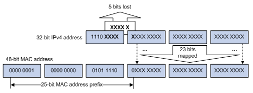
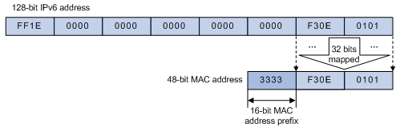

一、概述

单播地址标识单个接口
广播地址标识子网上的所有接口，一般局限于局域网。
多播地址标识一组接口，多播数据报仅由对该数据报感兴趣的接口接收。

二、组播传输的特点
组播传输的特点归纳如下：

1. “组播组”是一个用IP组播地址进行标识的接收者集合，主机通过加入某组播组成为该组播组的成员，从而可以接收发往该组播组的组播数据。组播源通常不需要加入组播组。

2. 信息的发送者称为“组播源”。一个组播源可以同时向多个组播组发送信息，多个组播源也可以同时向一个组播组发送信息。

3. 所有加入某组播组的主机便成为该组播组的成员。组播组中的成员是动态的，主机可以在任何时刻加入或离开组播组。组播组成员可以广泛地分布在网络中的任何地方。

4. 支持三层组播功能的路由器或三层交换机统称为“组播路由器”或“三层组播设备”。组播路由器不仅能够提供组播路由功能，也能够在与用户连接的末梢网段上提供组播组成员的管理功能。组播路由器本身也可能是组播组的成员。

三、多播地址

1. IPv4中的D类地址

IPv4中的D类地址（224.0.0.0到239.255.255.255）是多播地址。D类地址的低28位构成了多播组ID，整个32位地址则成为组地址。

224.0.0.1：所有主机组（all-hosts）。子网上所有具有多播能力的主机必须在所有具有多播能力的接口上加入该组
224.0.0.2：所有路由器组（all-routers），所有多播路由器必须在所有具有多播能力的接口加入该组
介于224.0.0.0~224.0.0.255之间的地址称为链路局部地址，被保留用于低级拓扑发现和维护协议。

2. 以太网组播MAC地址

以太网传输单播IP报文的时候，目的MAC地址使用的是接收者的MAC地址。但是在传输组播数据包时，其目的地不再是一个具体的接收者，而是一个成员不确定的组，所以要使用组播MAC地址。

(1) IPv4组播MAC地址

IANA规定，IPv4组播MAC地址的高24位为0x01005E，第25位为0，低23位为IPv4组播地址的低23位。IPv4组播地址与MAC地址的映射关系如图所示。

由于IPv4组播地址的高4位是1110，代表组播标识，而低28位中只有23位被映射到IPv4组播MAC地址，这样IPv4组播地址中就有5位信息丢失。于是，就有32个IPv4组播地址映射到了同一个IPv4组播MAC地址上，因此在二层处理过程中，设备可能要接收一些本IPv4组播组以外的组播数据，而这些多余的组播数据就需要设备的上层进行过滤了。

(2) IPv6组播MAC地址

IPv6组播MAC地址的高16位为0x3333，低32位为IPv6组播地址的低32位。如图所示，是IPv6组播地址FF1E::F30E:101的MAC地址映射举例。

四、组播协议

1. 通常，我们把工作在网络层的IP组播称为“三层组播”，相应的组播协议称为“三层组播协议”，包括IGMP/MLD、PIM/IPv6 PIM、MSDP、MBGP/IPv6 MBGP等；把工作在数据链路层的IP组播称为“二层组播”，相应的组播协议称为“二层组播协议”，包括IGMP Snooping/MLD Snooping、组播VLAN/IPv6组播VLAN等。

2. IGMP Snooping、组播VLAN、IGMP、PIM、MSDP和MBGP应用于IPv4；MLD Snooping、IPv6组播VLAN、MLD、IPv6 PIM和IPv6 MBGP应用于IPv6。
